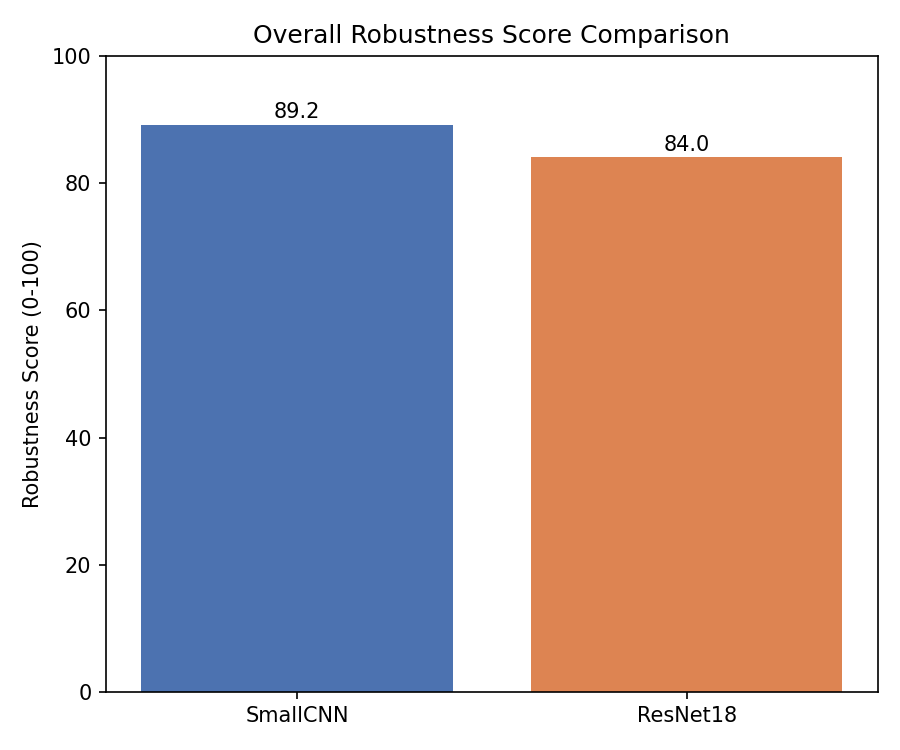

# Mediguard

**A robustness-testing framework for already-trained medical machine learning models.**

Medical ML models are usually judged by their accuracy on clean test images. Real hospital images are not clean: scanners add noise, focus slips, exposure varies. Mediguard takes a trained model, subjects the same test images to controlled real-world disturbances, and measures how much the model's diagnostic performance degrades. The result is an interpretable **robustness score** and a clinical breakdown (sensitivity, specificity, false positives, false negatives), so models can be compared on reliability, not just accuracy.

> College major project. Think of it as a certification-style rating for ML models: how much can you trust this model when image quality is not perfect?

---

## What it does

```
Trained model + test images
        |
        v
Baseline evaluation (clean images)
        |
        v
Disturbance engine: Gaussian noise | Blur | Brightness | Contrast   (3-6 severity levels each)
        |
        v
Same model re-evaluated on every disturbed version
        |
        v
Performance drop + robustness score (0-100) + rating + graphs
```

The model is **never retrained or modified**. Mediguard only needs `model(image) -> prediction`, so it is black-box and architecture-agnostic (via the `ModelAdapter` wrapper).

## Key result (pneumonia chest X-rays, two models)

| | SmallCNN (from scratch) | ResNet18 (pretrained, fine-tuned) |
|---|---|---|
| Clean accuracy | 81.6% | **87.8%** |
| Robustness score | **89.3 / 100** (Good) | 84.0 / 100 (Good) |
| Weakest area | Blur | Gaussian noise |

The more accurate model is **not** the more robust one: ResNet18 wins on clean accuracy but degrades much more under noise. A plain accuracy leaderboard would hide this. Both models also collapse to predicting "PNEUMONIA" for every image under heavy darkening, low contrast or blur (specificity 0%), which is why Mediguard reports sensitivity/specificity and not accuracy alone.



More graphs are in [`results/`](results/).

---

## Project structure

```
Medigaurd00/
|-- dataset_loader.py        # loads train/val/test (ImageFolder), preprocessing
|-- train_cnn.py             # SmallCNN definition + training
|-- train_resnet.py          # ResNet18 transfer learning + training
|-- model_adapter.py         # uniform predict() interface for any PyTorch model
|-- evaluate_baseline.py     # clean-data metrics (accuracy, sensitivity, specificity, confusion matrix)
|-- evaluate_noise.py        # Gaussian noise disturbance
|-- evaluate_blur.py         # Gaussian blur disturbance
|-- evaluate_brightness.py   # darker / brighter
|-- evaluate_contrast.py     # flatter / harsher
|-- robustness_score.py      # aggregates disturbances into one score (SmallCNN)
|-- robustness_report.py     # generic single-model report (choose any registered model)
|-- compare_models.py        # side-by-side comparison of both models
|-- visualize_results.py     # generates the graphs in results/
|-- results/                 # saved graphs
|-- yale_reference/          # original Yale code, kept for reference only (see Credits)
|-- requirements.txt
`-- README.md
```

Not tracked in Git (too large or private): `data/` (dataset), `*.pt` (trained model weights), API credentials.

---

## Setup

Requires Python 3.10 and Conda. An NVIDIA GPU is optional but makes training far faster.

**1. Create and activate an environment**
```
conda create -n mediguard python=3.10
conda activate mediguard
```

**2. Install PyTorch** (choose one)
```
# NVIDIA GPU (CUDA 12.4 build)
pip install torch torchvision --index-url https://download.pytorch.org/whl/cu124

# CPU only
pip install torch torchvision --index-url https://download.pytorch.org/whl/cpu
```

**3. Install the other dependencies**
```
pip install -r requirements.txt
```

**4. Get the dataset** (Kaggle "Chest X-Ray Images (Pneumonia)")

Place your Kaggle API token at `~/.kaggle/kaggle.json`, then:
```
kaggle datasets download -d paultimothymooney/chest-xray-pneumonia
Expand-Archive -Path chest-xray-pneumonia.zip -DestinationPath data\chest_xray -Force
```
The zip extracts with a duplicated nested folder. Remove the extras so the structure is `data/chest_xray/chest_xray/{train,val,test}/{NORMAL,PNEUMONIA}`:
```
Remove-Item -Recurse -Force "data\chest_xray\chest_xray\chest_xray"
Remove-Item -Recurse -Force "data\chest_xray\chest_xray\__MACOSX"
```

**5. Check that the data loads**
```
python dataset_loader.py
```

---

## Usage

**Train the two models** (saves `pneumonia_cnn_best.pt` and `pneumonia_resnet18_best.pt`):
```
python train_cnn.py
python train_resnet.py
```

**Full robustness report for one model** (prompts you to pick a model, or pass its name):
```
python robustness_report.py
python robustness_report.py resnet18
```

**Compare models side by side:**
```
python compare_models.py
```

**Generate the graphs** (saved to `results/`):
```
python visualize_results.py
```

Individual disturbance scripts (`evaluate_noise.py`, `evaluate_blur.py`, `evaluate_brightness.py`, `evaluate_contrast.py`) print the full clinical metrics at every severity.

---

## Methodology

**Disturbances.** Noise is added to the normalized tensor (sigma 0.05 / 0.10 / 0.20). Blur, brightness and contrast are applied to the raw image before normalization (blur kernel/sigma pairs; brightness and contrast factors in both directions, fixed rather than random for reproducibility).

**Metrics.** Accuracy, precision, recall (sensitivity), specificity, F1 and the confusion matrix, with false positives and false negatives reported explicitly because they map to real clinical consequences.

**Robustness score.** For each disturbance category, average accuracy across severities, divide by the model's own clean accuracy (capped at 1.0) to get *retention*, then average retention across the four categories and multiply by 100. This rates **stability**, not raw accuracy. Rating bands (provisional): 90-100 Excellent, 75-89 Good, 60-74 Moderate, 40-59 Weak, below 40 Poor.

**Class imbalance.** The training set is roughly 3:1 pneumonia to normal, so the loss is class-weighted (NORMAL weighted about 2.89x).

## Limitations and future work

- The Kaggle validation split has only 16 images, so validation accuracy is noisy; it should be re-split from the training set.
- Disturbance severities were chosen empirically, not calibrated against real scanner measurements.
- The averaged score can hide worst-case collapse; a worst-case score is a planned addition.
- Rating bands are provisional and need justification across more models.
- Currently two registered models and one dataset; the code is designed to generalize to other datasets (class folders) and multi-class metrics.
- Planned: web dashboard (upload models and datasets, view scores and comparisons), unit/integration tests, more disturbances.

---

## Credits

- **Reference project:** [Aneja Lab, Yale School of Medicine, *Adversarial Attacks on Medical Deep Learning Models*](https://github.com/Aneja-Lab-Yale/Aneja-Lab-Public-Adversarial-Imaging). Studied to understand the general robustness-testing pipeline. Mediguard is an independent implementation (PyTorch instead of TensorFlow 1.15, real-world image disturbances instead of FGSM/PGD/BIM attacks, different dataset and models). Their original files are preserved unmodified in `yale_reference/`, and on the `original-yale` branch.
- **Dataset:** Kermany et al., *Chest X-Ray Images (Pneumonia)*, via Kaggle ([paultimothymooney/chest-xray-pneumonia](https://www.kaggle.com/datasets/paultimothymooney/chest-xray-pneumonia)).
- **Libraries:** PyTorch, torchvision (ResNet18 ImageNet weights), scikit-learn, matplotlib.
